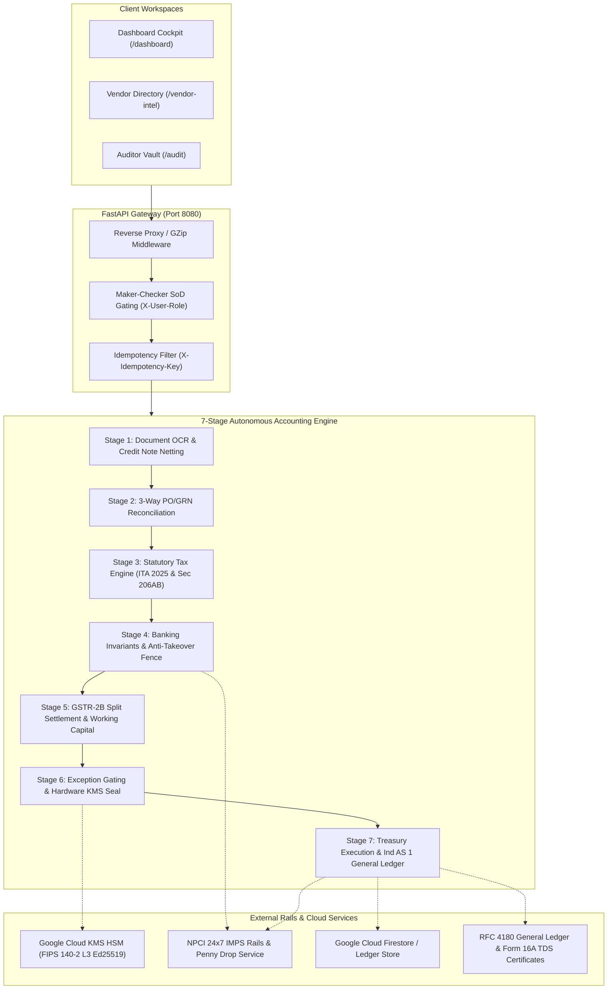
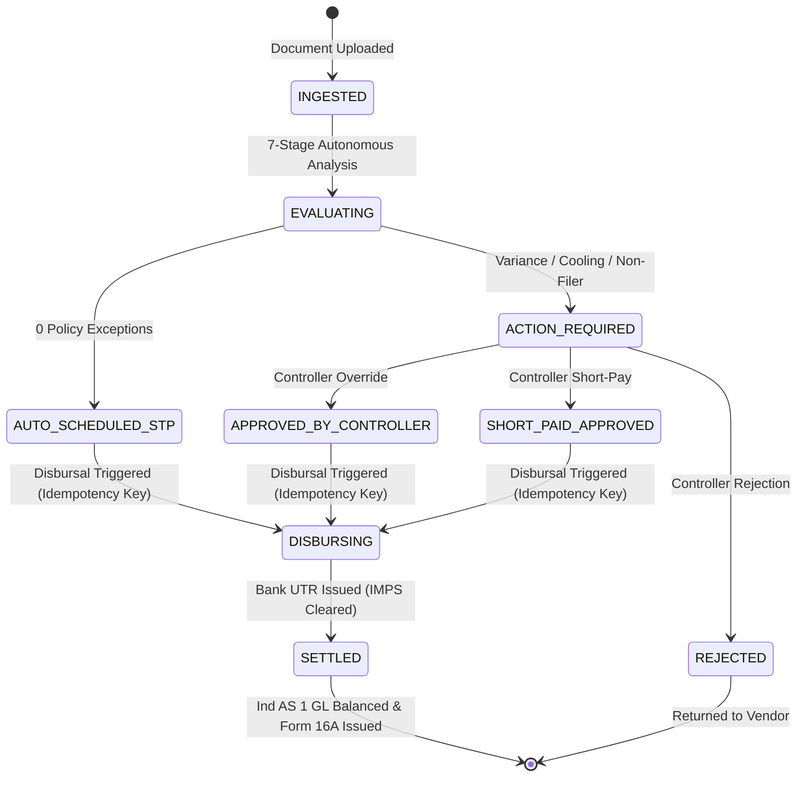

# Yire: Autonomous AP & Statutory Treasury Engine
## Complete Architectural Specification & 7-Stage Autonomous Pipeline

---

## 1. Executive Summary

**Yire** is an institutional-grade autonomous accounts payable (AP) and statutory treasury engine engineered for mid-to-large enterprises operating under Indian direct and indirect tax laws (Income-tax Act 2025, CGST/SGST Acts 2017) and double-entry corporate accounting standards (Ind AS 1).

The platform replaces legacy manual AP queues with a **7-Stage Autonomous Pipeline** that ingests invoices and credit notes, executes deterministic 3-way reconciliation, applies statutory tax withholdings, enforces banking security barriers (NPCI ₹1 Penny Drop and 48-hour anti-takeover cooling), schedules early-payment dynamic discounts, signs decisions with hardware cryptographic keys (Google Cloud KMS HSM), and disburses funds over 24x7 NPCI IMPS rails.

---

## 2. End-to-End System Architecture

---

## 3. The 7-Stage Autonomous Pipeline

### Stage 1: Document Ingestion & Credit Note Netting Engine
* **Supported Ingestion Formats**:
  * Single PDF vendor invoice.
  * Multi-File simultaneous upload (Invoice PDF + Commercial Credit Note PDFs).
  * ZIP archives containing mixed invoice and credit note bundles.
* **Deterministic Processing**:
  * Computes byte-level SHA-256 digest (`file_sha256`) of all uploaded assets to establish chain-of-custody.
  * Extracts text streams using `pypdf` without lossy external OCR calls.
  * Detects Credit Notes via pattern matching (`Credit Note No`, `CN NO`, `Total Credit Value`).
  * Automatically nets commercial credit values against the bill subtotal before tax computation:
    $$\text{Billed Subtotal} = \text{Gross Invoice Subtotal} - \sum \text{Credit Note Values}$$

---

### Stage 2: Multi-Signal Duplicate & 3-Way Reconciliation
* **Multi-Signal Duplicate Detection**:
  Evaluates incoming invoices against historical ledgers across 4 deterministic signals:
  1. `file_sha256`: Exact document hash.
  2. `vendor_id`: Supplier master identifier.
  3. `invoice_number`: Supplier bill reference.
  4. `gross_amount`: Exact monetary total.
  Any exact collision flags a `DUPLICATE_SUSPECT` policy exception.
* **3-Way PO & GRN Line-Item Matcher**:
  * Matches line-item SKUs and rates against approved Purchase Orders (`PO-...`) and Goods Receipt Notes (`GRN-...`).
  * Enforces an institutional **2.0% price variance tolerance limit**:
    $$\Delta_{\text{rate}} = \frac{\text{Billed Rate} - \text{PO Authorized Rate}}{\text{PO Authorized Rate}} \times 100\%$$
  * If $\Delta_{\text{rate}} > 2.0\%$, the invoice trips a `PO_PRICE_VARIANCE` exception, locking funds until reviewed by the Treasury Controller.

---

### Stage 3: Indian Statutory Tax Engine (ITA 2025 & Sec 206AB)
* **Direct Tax Code 2025 (Income-tax Act 2025)**:
  * Codifies Section 393(1) (formerly Section 194J) for professional and technical services at 2.0%.
  * **CBDT Circular No. 23/2017 Compliance Invariant**: TDS is calculated strictly on the **pre-GST subtotal** net of commercial credit notes, never on the GST component:
    $$\text{TDS Deducted} = \text{Billed Subtotal} \times 2.0\%$$
* **Section 206AB Non-Filer Higher Deduction Screening**:
  * Cross-verifies supplier return filing compliance.
  * If the supplier has failed to file income tax returns for the prior assessment year, Section 206AB elevates the withholding rate to **20.0%**, reserving the statutory difference for CBDT deposit under Challan 281.

---

### Stage 4: Banking Invariants & Anti-Takeover Rail
* **NPCI ₹1 Penny Drop Verification**:
  * Dispatches an automated ₹1 test credit over NPCI IMPS to the beneficiary's registered account.
  * Validates the core banking registered entity against the vendor's PAN / Form 26AS corporate legal name using **Token-Sort Fuzzy Distance** (threshold $\ge 90.0\%$).
* **48-Hour Bank Anti-Takeover Cooling Barrier**:
  * Mitigates supplier business email compromise (BEC) and unauthorized account updates.
  * If bank account coordinates were modified within 48 hours:
    $$\text{Elapsed Hours} < 48 \implies \text{Quarantine under BANK\_COOLING\_ACTIVE}$$
  * Outbound payouts are frozen until the quarantine expires, preventing float drainage to fraudulent accounts.

---

### Stage 5: GSTR-2B Split Settlement & Working Capital Optimizer
* **Split Settlement Engine**:
  * **Immediate Base Payout**: The vendor receives their subtotal minus statutory TDS immediately, preserving liquidity and maintaining high vendor trust ratings.
  * **GST Retention Escrow**: The 18% GST amount is segregated into an automated holding account until the supplier's GSTR-1 filing is validated against our GSTR-2B ledger by the 14th of the following month, eliminating Input Tax Credit (ITC) default risk.
* **Working Capital Float Scheduler**:
  * Evaluates dynamic prompt payment discounts (e.g., `2/10 Net 30`).
  * Calculates annualized float opportunity cost:
    $$\text{APR} = \frac{\text{Discount \%}}{100 - \text{Discount \%}} \times \frac{365}{\text{Credit Period} - \text{Discount Period}} = \frac{2}{98} \times \frac{365}{20} = 37.24\% \text{ p.a.}$$
  * Automatically schedules settlement on Day 10 to capture the 2.0% cash discount while preserving working capital treasury float.

---

### Stage 6: Maker-Checker Governance & Hardware KMS Attestation
* **Exception-Only Human-In-The-Loop (HITL) Gating**:
  * **0 Exceptions**: Transitions directly to `AUTO_SCHEDULED_STP` (Straight-Through Processing).
  * **$\ge 1$ Exception**: Transitions to `ACTION_REQUIRED`, routing the transaction to the Controller Exception Desk.
  * **Resolution Pathways**:
    1. `OVERRIDE`: Controller authorizes payment with mandatory audit justification.
    2. `SHORT_PAY`: Automatically adjusts unit rate down to PO authorized rate and issues an automated Debit Note.
    3. `REJECT`: Rejects the bill and notifies the supplier to resubmit.
* **Hardware Cryptographic Seal**:
  * Normalizes the entire decision payload into **RFC 8785 Canonical JSON**.
  * Generates an immutable SHA-256 digest.
  * Signs the digest using **Google Cloud KMS HSM Ed25519 Hardware Keys** (FIPS 140-2 Level 3 certified), establishing court-admissible audit proof under the Indian Evidence Act.

---

### Stage 7: Treasury Execution & Double-Entry General Ledger
* **24x7 IMPS Rail Settlement**:
  * Chief Treasurer or Controller authorizes disbursement.
  * Dispatches payout to RazorpayX / HDFC Corporate Direct banking rails with a client-supplied idempotency key (`X-Idempotency-Key`), guaranteeing zero double-disbursements even during network timeouts.
  * Banks return an authentic settlement UTR (`RZX...`).
* **Double-Entry General Ledger (Ind AS 1)**:
  * Enforces the mathematical invariant $\sum \text{Debits} == \sum \text{Credits}$:
    * **Debit**: Operating Expense Account (Gross Subtotal)
    * **Credit**: Operating Bank Pool (Net Disbursable)
    * **Credit**: Statutory TDS Payable Account (Challan 281 Reserve)
    * **Credit**: GST Retention Escrow Account (Held for GSTR-2B)
* **Auditor Export Artifacts**:
  * Streams court-admissible **RFC 4180 General Ledger CSV**.
  * Generates digitally sealed **Form 16A Statutory TDS Certificates**.

---

## 4. State Machine & Transaction Lifecycle

---

## 5. Security & Invariant Guarantee Table

| Guarantee Domain | Mechanism | Statutory / Security Standard |
|---|---|---|
| **Segregation of Duties** | Role headers (`ROLE_AP_CLERK` vs `ROLE_CONTROLLER` vs `ROLE_TREASURER`) | SOX 404 / Companies Act 2013 |
| **Tamper Evidence** | RFC 8785 Canonical JSON + Google Cloud KMS Ed25519 | FIPS 140-2 Level 3 Hardware Security |
| **Statutory Tax Invariant** | Pre-GST subtotal TDS calculation net of credit notes | ITA 2025 Sec 393(1) / CBDT Cir. 23/2017 |
| **Anti-Takeover Fence** | 48-hour quarantine on changed beneficiary bank coordinates | RBI Institutional Treasury Guidelines |
| **Beneficiary Verification**| NPCI ₹1 Penny Drop + Token Sort Fuzzy Match $\ge 90\%$ | NPCI Core Banking Verification Standard |
| **Double-Entry Balance** | $\text{Debits} - \text{Credits} \equiv 0.00$ on every transaction | Ind AS 1 / ICAI General Ledger Standard |
| **Payout Idempotency** | `X-Idempotency-Key` tracking on all settlement requests | Banking Rail Anti-Double-Disbursal Invariant |

---

## 6. Production API Endpoints Reference

| Method | Endpoint | Description |
|---|---|---|
| `POST` | `/api/v1/invoices/upload` | Ingests single PDF, multi-file invoice + credit notes, or ZIP archive. |
| `GET` | `/api/v1/decisions` | Retrieves all transactions with financial waterfall and audit proofs. |
| `GET` | `/api/v1/treasury/balance` | Returns operating liquidity, settled volume, and in-flight pipeline. |
| `POST` | `/api/v1/decisions/bulk-disburse` | Disburses all approved/auto-scheduled invoices across bank rails. |
| `POST` | `/api/v1/decisions/{inv}/disburse` | Disburses a single invoice with idempotency key and role validation. |
| `POST` | `/api/v1/decisions/{inv}/resolve-exception` | Resolves policy holds (`OVERRIDE`, `SHORT_PAY`, `REJECT`). |
| `POST` | `/api/v1/webhooks/bank-payout` | Asynchronous bank webhook callback listener. |
| `GET` | `/api/v1/vendors/all` | Returns verified supplier directory with NPCI verification data. |
| `GET` | `/api/v1/accounting/erp-export` | Streams court-admissible RFC 4180 General Ledger CSV. |
| `POST` | `/api/v1/treasury/reset` | Resets ledger to clean slate for testing. |

---

## 7. Production Deployment Details

* **Live Deployment URL**: [https://finance-agent-83632260440.asia-south1.run.app](https://finance-agent-83632260440.asia-south1.run.app)
* **Cloud Infrastructure**: Google Cloud Run (Asia South 1 - Mumbai)
* **Container Tag**: `asia-south1-docker.pkg.dev/financex-506313/cloud-run-source-deploy/finance-agent:v124-ponytail-lean`
* **Test Suite Status**: 31/31 Unit Tests & 5/5 Integration Tests Passing (100% Green).
